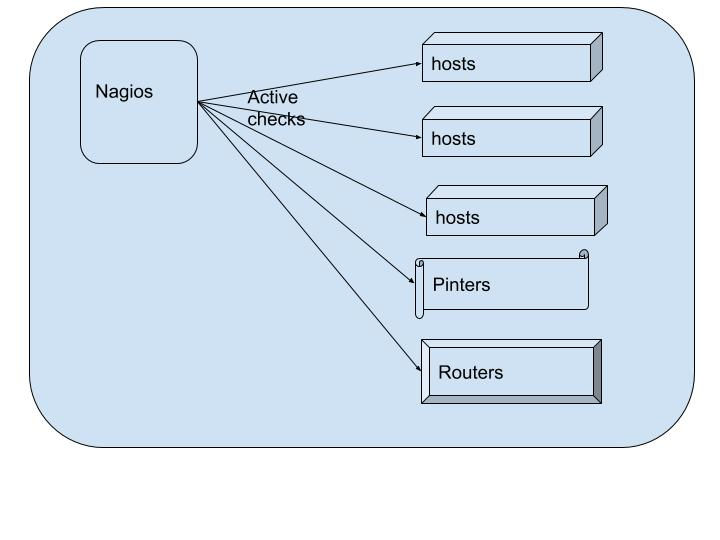
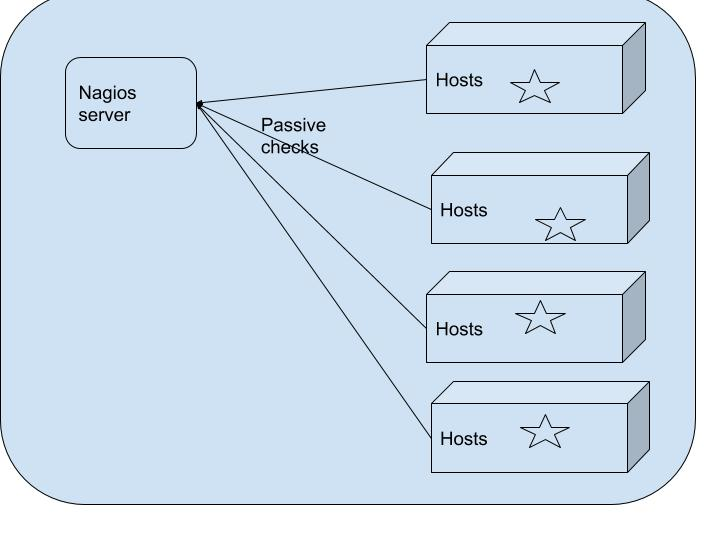
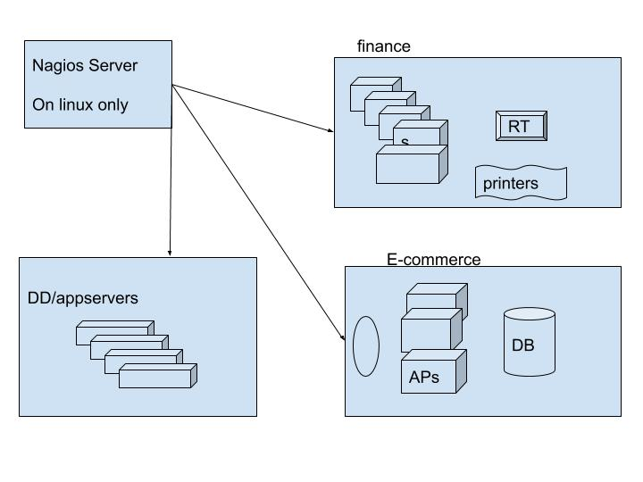

# System Monitoring:

## checks
  * active checks
     * any ping ble device,we can able monitor.
     
  * passive checks
     * we install agent on each host
     

### By using system monitoring 
    * it can monitor individually 
    * it can monitor groups
    
   

## install and configure nagios
   * nagios3 : open sources 
   * nagios4 : open sources
   * nagios XI : not open sources

## install nagios3:
   * use ubuntu 16 
   * install LAMP by tasksel
   * install nagios3

### config nagios3

  ```
    1  apt-get update
    2  apt-get install tasksel
    3  tasksel
    4  apt-get install nagios3
    
    http://34.228.216.230/nagios3/

  ```


 